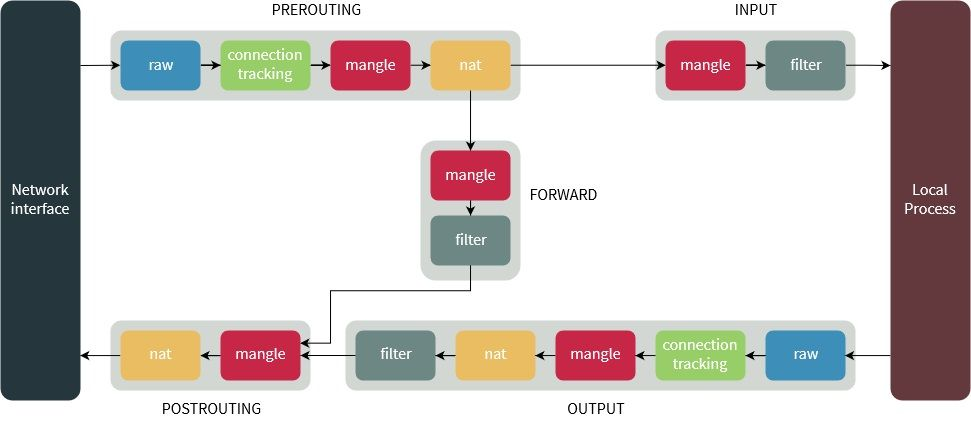

# *Administration of Istio*

## *Installing Istio*

Installing istio on a local cluster is pretty easy with `istioctl`. Just run `istioctl` and it will set up the control plane and ingress gateway. You can uninstall the instio configurations with `istioctl uninstall --purge`. To get an overview of the mesh that is installed, run `istioctl proxy-status`. This will return something like:
```
NAME                                                  CLUSTER        CDS        LDS        EDS        RDS          ECDS         ISTIOD                      VERSION
istio-ingressgateway-6785fcd48-pr5xc.istio-system     Kubernetes     SYNCED     SYNCED     SYNCED     NOT SENT     NOT SENT     istiod-65448977c9-r8hwd     1.16.1
```
This information of understanding how istio if managing the configuration of Envoy deployed as gateways helps in relation to how Envoy instances are managed in the data plane. The data plane, to review, is the sidecar proxies that are deployed with the application. The only side car proxies deployed in the above example belong to the ingress gateway.

## *Networking in Istio*

The following ports are used by the istio sidecar proxy(Envoy):

| Port	| Protocol	| Description | Pod-internal only |
| :--- | :--- | :--- | :--- |
| 15000	| TCP | Envoy admin port (commands/diagnostics) | Yes |
| 15001	| TCP | Envoy outbound | No |
| 15004	| HTTP | Debug port	| Yes |
| 15006	| TCP | Envoy inbound | No | 
| 15008	| H2 | HBONE mTLS tunnel port | No |
| 15009	| H2C | HBONE port for secure networks | No |
| 15020	| HTTP | Merged Prometheus telemetry from Istio agent, Envoy, and application | No |
| 15021	| HTTP | Health checks | No |
| 15053	| DNS |DNS port, if capture is enabled | Yes |
| 15090	| HTTP |	Envoy Prometheus telemetry | No |

And the following ports are used by the istio control plane(istiod):

| Port	| Protocol	| Description | Local host only |
| :--- | :--- | :--- | :--- |
| 443	| HTTPS | Webhooks service port	| No |
| 8080	| HTTP | Debug interface (deprecated, container port only) | No |
| 15010	| GRPC | XDS and CA services (Plaintext, only for secure networks) | No |
| 15012	| GRPC | XDS and CA services (TLS and mTLS, recommended for production use) | No |
| 15014	| HTTP | Control plane monitoring | No |
| 15017 | HTTPS | Webhook container port, forwarded from 443 | No |

## *Service Proxy*

A service proxy is the client-side intermediary transiting requests on behalf of the service. It enables applications to send a receive messages over a channel as method calls. In Istio's case, traffic is transparently intercepted using iptables rules and redirected to the service proxy. 

### *iptables*

iptables is a user-space CLI for managing host-based firewalling and packet manipulation in Linux. Netfilter is the Linux kernel module comprising tables, chains, and rules.



An iptables environment will contain multiple tables: *Filter*, *NAT*, *Mangle* and *Raw*. Filter is used by default and each table can contain multiple chains. Chains can contain multiple rules and rule match and map packets. iptables chains are network namespaced, so changes made within a pod don't affect other pods or the node on which the pod is running([veth/vnets](https://developers.redhat.com/blog/2018/10/22/introduction-to-linux-interfaces-for-virtual-networking#)).

You can view the iptables in action on the pod by running `iptables -t nat --list`. Pilot(istiod) configures the traffic policy and the service proxies implement them. By intercepting each packet, these proxies add resiliency to a distributed system by standardizing the location of a resource(app.example.com) while the service can move from location to location.

### *Envoy*

One thing to note on Envoy: it has the capability to transparently operate as a gRPC-JSON transcoder meaning it allows a client to send an HTTP/1.1 JSON payload and translate the request into the corresponding gRPC call. This works in the other direction as well.

### *Sidecar Injection*

You can manually inject a sidecar into an application with `istioctl kube-inject`. This will create the manifest files with the additional container, so it is usually paired with `kubectl apply`. The `istioctl kube-inject` function is **NOT** idempotent so be careful.

The istio-sidecar-injector mutating webhook also injects sidecars with the `istio-injection=enabled` label on namespaces. A little easier to work with than the manual intervention. To set up network filters(iptables) to control traffic flow, Istio uses init containers when pods are starting up.

## *Pilot(Istiod)*

Istiod - The Istio control plane. It provides service discovery, configuration and certificate management. It consists of the following sub-components:
- Pilot - Responsible for configuring the proxies at runtime.
- Citadel - Responsible for certificate issuance and rotation.
- Galley - Responsible for validating, ingesting, aggregating, transforming and distributing config within Istio.

### *A note on Envoy:*

Envoy is said to have xDS APIs, which means *Discovery Service* APIs. The 'x' in the name generally means one of the four configuration primitives. These include LDS, RDS, CDS, and EDS. 

- Listener Discovery Service(LDS) - Listeners come in two flavors: *physical* and *virtual*. Physical listeners are attached to a port, while virtual listeners accept traffic from the physical listeners.
- Routing Discovery Service(RDS) - Configure how that listener directs traffic to a specific cluster.
- Cluster Discovery Service(CDS) - A cluster in this instance is a group of endpoints along with information about how to contact these endpoints. Analogous to a kubernetes service. 
- Endpoint Discovery Service(EDS) - Enpoints are individual network hosts(IP addresses or DNS names) that Envoy will forward traffic to.

In relation to Istio's networking configurations, they map to Envoy's APIs nearly directly:
- Gatways configure physical listeners
- VirtualServices configure both virtual listeners and routes
- ServiceEntrys create clusters and populate their endpoints
- DestinationRules configure how to cmmunicate with clusters and create new clusters when they're used to define subsets

### Debugging and Troubleshooting Pilot

- `istioctl authn` is used for inspecting the state of mTLS in the mesh
- `istioctl proxy-config <bootstrap | listener | route | cluster> <k8s-pod>` will query the service proxy's administrative interface to retrieve the current state of the service proxy's configuration.
- `istioctl proxy-status <Istio service>` connects to Pilots debug interface and retrieves the xDS status of each connected service proxy instance, proving whether each proxy's configuration is up to date with the latest configuration in Pilot.

#### On page 112, there are debug endpoints that you can connect to for additional information on Pilot. Potential clctl automation?