# Istio Examples bookinfo

## Chapter 4: Deploying Istio

### Instructions for starting a k8s dashboard

Can follow examples in [this k8s dashboard README](https://github.com/kubernetes/dashboard).

First, create the k8s resources:
```
kubectl apply -f https://raw.githubusercontent.com/kubernetes/dashboard/v2.7.0/aio/deploy/recommended.yaml
```

Then, create a proxy for the k8s api server in the bg:
```
kubectl proxy &
```

Open up the dashboard at http://localhost:8001/api/v1/namespaces/kubernetes-dashboard/services/https:kubernetes-dashboard:/proxy/

You will need a bearer token that can be accessed by running
```
kubectl -n kube-system describe secret $(kubectl -n kube-system get secret | awk '/default-token/ {print $1}')
```

and you should be in!

### Install Istio and Registers CRDs

Get the latest istio repo by running `curl -L https://git.io/getLatestIstio | sh -`. Make sure you have istioctl(run `brew install istioctl` if not). Then, register crds with `kubectl apply -f istio-1.16.0/manifests/charts/base/crds/crd-all.gen.yaml` and get your resource definitions with `kc get crd | grep istio`.

### Install Istio Control-Plane Components

To install istio on the cluster using istioctl, run `istioctl install --set profile=demo -y`. This installs istiod and the ingress and egress gateways. The installation can be verified with `istioctl verify-install`.

### Deploying a Sample Application

Deploying the sample bookinfo application with `kc apply -f istio-1.16.0/samples/bookinfo/platform/kube/bookinfo.yaml`. When deploying, we do not see the istio sidecar automatically deployed. To understand why, run the `istioctl analyze` cmd. This will help debug istio issues and provide recommendations to remediating issues.

Ran `kubectl label namespace default istio-injection=enabled` to enable istio sidecar injection on the namespace. Need to redeploy the bookinfo cluster, so will delete the file and then redeploy.

## Traffic Management

#### Gateways

In order to catch all http traffic for bookinfo.app, we must first create a gateway to intercept all traffic and route it to the product page. Example is at bookinfo/bookinfo-gateway.yml. 
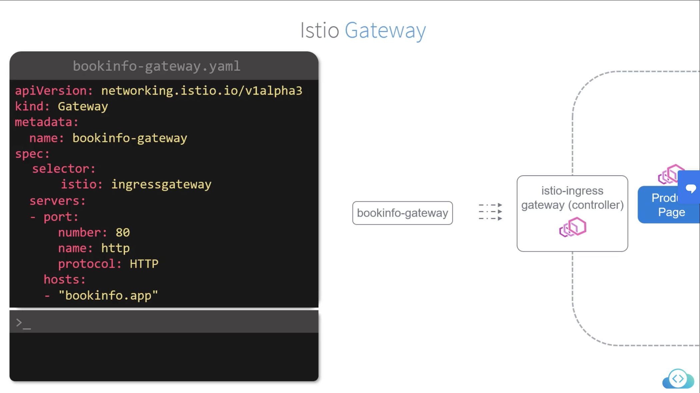
We target the istio controller that sits at the edge of the mesh with the selector statement. Apply this configuration and verify the deployment with `kc get gateway`.

#### Virtual Services

Virtual services are istios way of controlling all routing rules. They define routing rules for all traffic coming from an ingress gateway into the service mesh. The example template is at bookinfo/virtual-svc1.yml and below is the configuration:
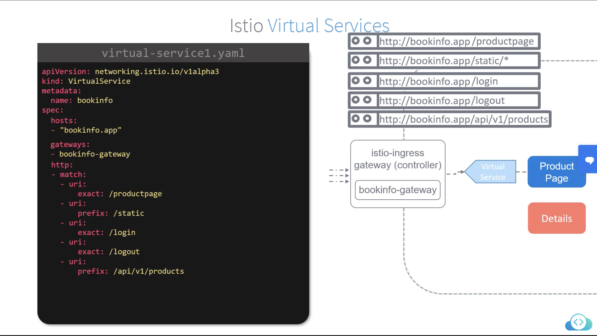

Below is an example of a weighted virtual service deployment. We can toggle the weights in order to define how much traffic is flowing to the pods and give us a more granular approach to creating new services.
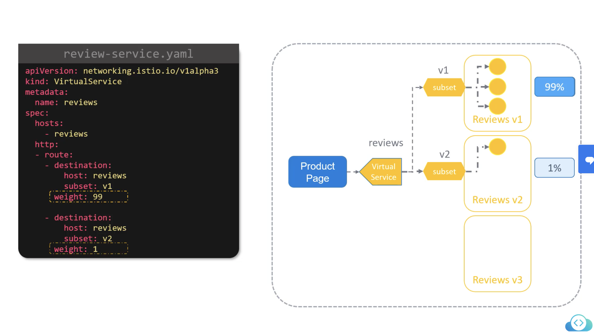

#### Destination Rules

In the previous example, there is a new term called subsets. Subsets are defined in destination rules, which we will cover now. An example subset is created in bookinfo/review-destination.yml. Further notes on the destination rule is there.

#### Fault Injections

Here is an example of the two injection faults:
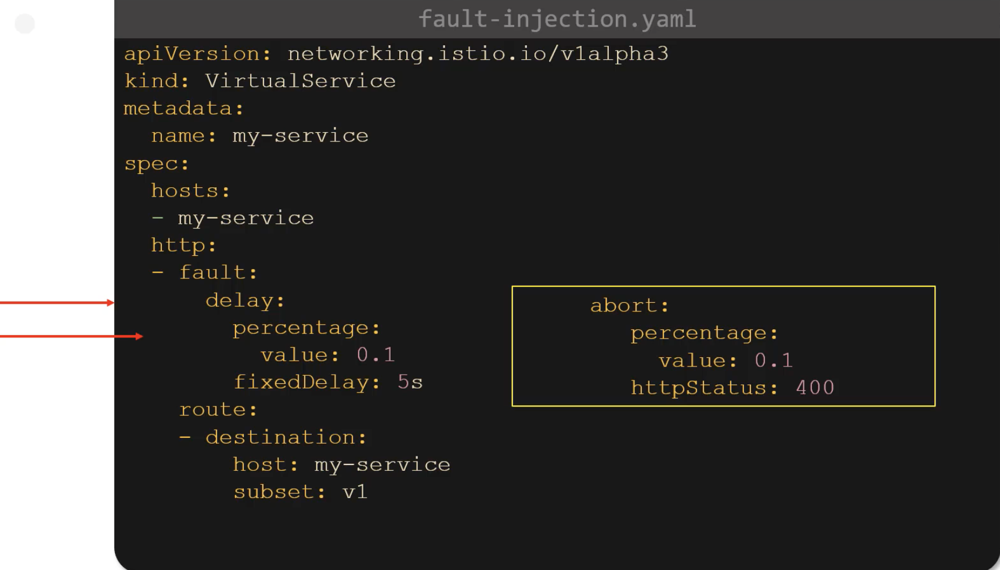

#### Timeouts

Timeouts require a request to be fulfilled in a certain amount of time. If it doesn't succeed in the specified amount of time, the request will fail and return an error. A timeout of 3s was added to virtual-svc1 and can be tested with a delay fault injection.

#### Retries

Retries are also set at the virtual service level. Here is an example of one along with istio's default retry settings:
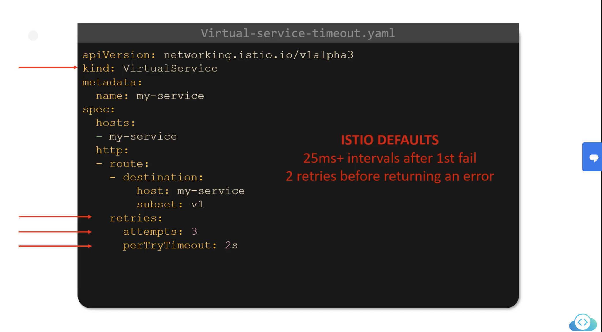

#### Circuit Breakers

Circuit breaking limits the number of queued requests. Once a limit has been reached, all further requests will fail. Here is an example flow of that:
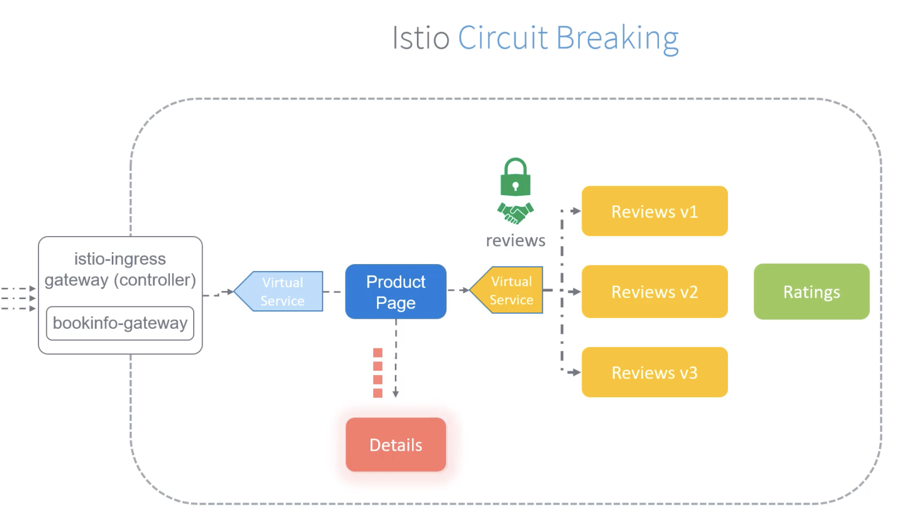
and here is an example configuration within the DestinationRule:
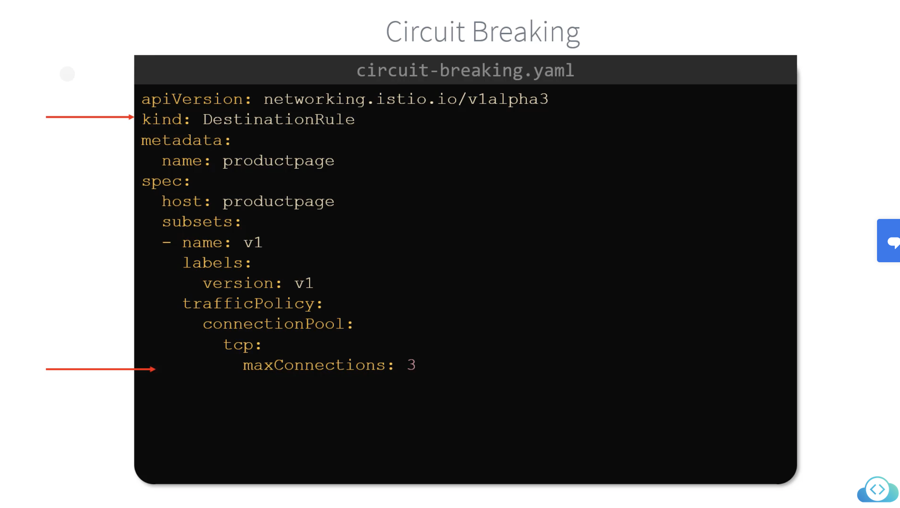

#### A/B Testing

Can be easily controlled through the virtual services by weighing the traffic. Refer to virtual service if you need a review.

### Security

Security is important in istio and allows admins to easily implement mTLS between services and configure fine-grained access policies to all their services. Here is an example flow of the security we will go over:
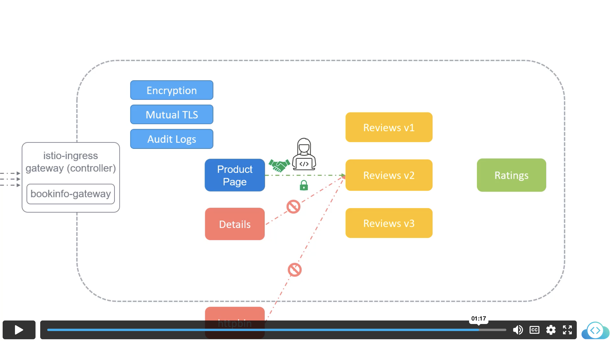
And here is the istio security architecture:
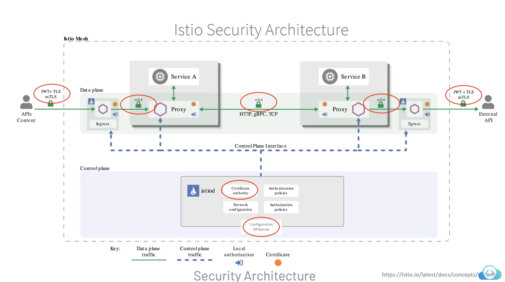

#### Authentication

Authentication between services in istio is typically handled with mTLS. This verifies that services are who they truely advertise themselves as and promotes encrypted traffic within the mesh. Here is an example of a peer authentication policy for the reviews service specifically:
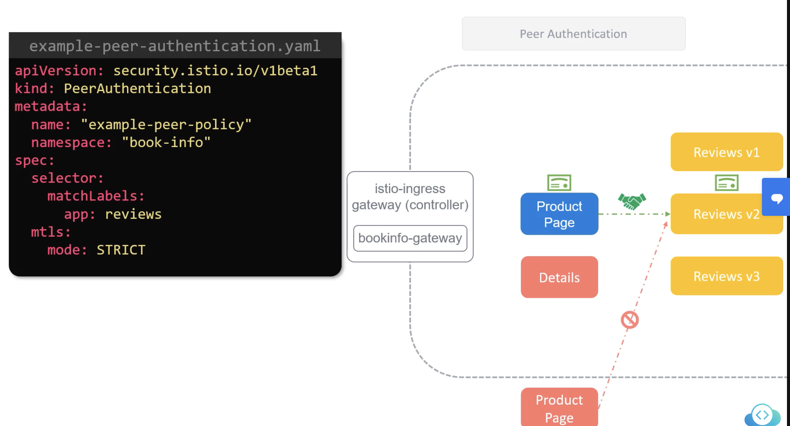
and here is an example of a namespace wide authentication policy:
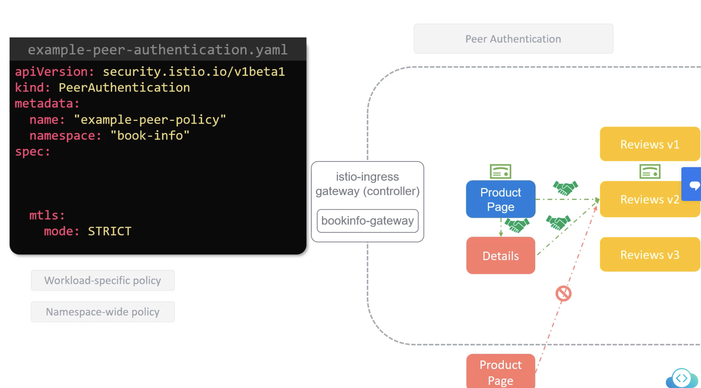
and here is an example of an authentication policy for the entire mesh:
