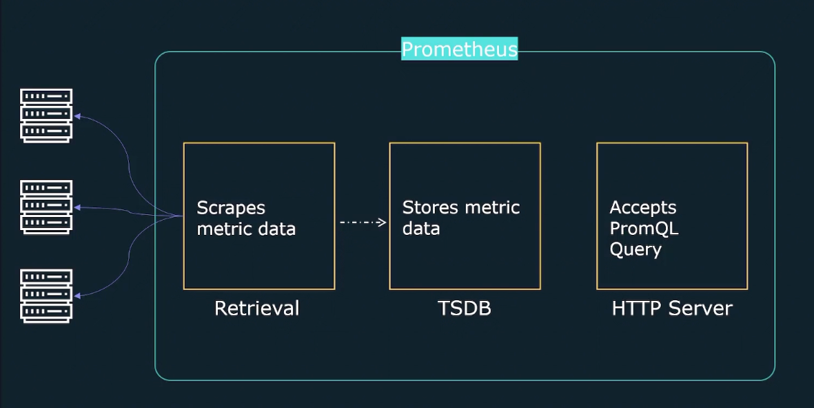

# ***Prometheus Fundamentals***

## *Architecture*

Prometheus has 3 fundamental workers: one to scrape metric data, on time-series database to store the data, and an HTTP server to act as a frontend to interact with your data.

There are also *exporters*, which act as targets for Prometheus to pull metrics from. When there are short-lived jobs, they can push their metrics to a Pushgateway, and then allow Prometheus to then pull from the Pushgateway. Service discovery and alert manager are also a portion of the Prometheus architecture. 

## *Metrics* 

A metric consists of the following values:

`<metric_name>[{<label_1="value_1">,<label_N="value_N">}] <metric_value>`

Prometheus also represents a timestamp in the unix timestamp which is the number of seconds sine Epoch(January 1st 1970 UTC). Metric types are as follows:
- Counter
- Gauge
- Histogram
- Summary

Labels are key-value pairs associated with a metric.